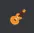
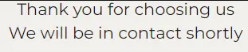
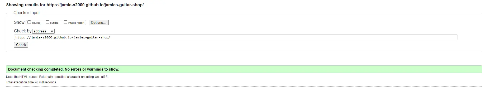
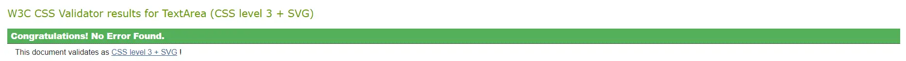
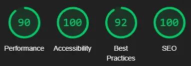
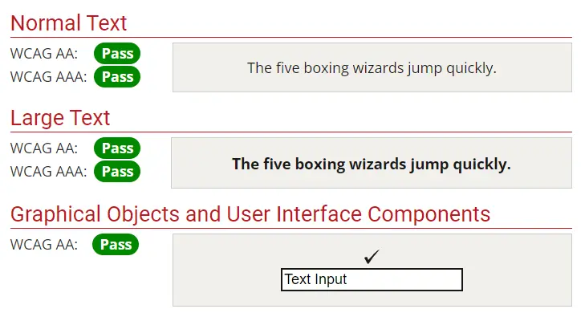

# Jamie's Guitar Shop

Jamie's Guitar Shop is a small independent guitar shop in the heart of Newcastle.

The website is designed to show customers the services the shop provides.


<!--add contents section-->

## Planning and Development

- __Target Audience__

The target audience for the website is Guitar Players.

The website aims to inform guitarists of the services and products provided by the shop.

These are people who:

* Are looking to purchase new guitar gear (e.g. guitars, amps, straps etc.).

* Are looking to join a community of people to play guitar with.

* Are looking for a guitar tech for any alterations to their guitars.

<br>

- __User Stories__

    * As a user, I want to find out more about Jamie's Guitar Shop.

    * As a user, I want to find a local guitar shop.

    * As a user, I want to find a community of guitar players.

    * As a user, I want to find a reliable guitar tech.

<br>

- __Site Objectives__

    * To inform customers of a local shop.

    * To show the user where to find the shop.

    * To give the user a way to contact the shop.

    * To inform users when they can visit.

    * To inform users when events are happening.

    * To help customers get in touch with a guitar tech.

<br>

- __Approach__

    * The site will be created with the principles of user design.

    * The site will provide users with information about the shop.

    * The site will provide users with a way to contact the shop.

    * The site will provide users with a way to find it on social media.

    * The site will be accessible.

    * The site will be easily navigated and consistent throughout.

<br>

- __Colour Scheme__

The colours of the site were chosen to match the colours of the guitars and to contrast each other.

* The yellow colour was picked as a common colour for acoustic guitars while matching the Les Paul image.

* Dark purple was used for titles and social links as it contrasts the yellow and gives some variance from the text.

* The text is a very dark grey chosen to make the text slightly less harsh while also maintaining contrast

* Finally the background of the whole site is off-white making it easier to look at whilst also matching the white on the Stratocaster.


<br>

- __Typography__

The fonts were chosen to allow for easy reading in the document whilst the titles give a more welcoming vibe.

* Montserrat Alternatives: Gives the titles a more laid-back and welcoming vibe to the site whilst staying easily readable.

* Monserrat: This is a clear and concise font that is easily legible whilst being a slightly toned-down version of the title font.

<br>

## Features

### Existing Features

- __Favicon__

* The favicon was chosen to be relevant to the website and to suit the colours.



- __Navigation Dropdown__

* The navigation dropdown menu is there to help users navigate the site.

* It has links to the home page, guitar jams page and guitar techs page.


<br>

- __Sticky Navigation bar__

* The sticky navigation bar allows users to navigate the site no matter where on the page they are.

* It sticks in a fixed position on the top of each page.

* It uses a burger icon to help the user recognise its use.


<br>

- __Images__

* The images chosen were two of the most popular guitars on the home page and a selection on the jams page.

* The home page guitars were chosen as they will be easily recognisable.

* The selection was chosen to show more variation in guitars.

The links to the images are:

* Stratocaster (1st home page image): https://www.pexels.com/photo/electric-guitar-amplifier-cord-port-808354/

* Les Paul (2nd home page image): https://www.pexels.com/photo/close-up-shot-of-a-guitar-8134200/

* Asorted guitars (guitar jams image): https://www.pexels.com/photo/electric-guitars-on-display-5396357/


<br>

- __About Us Section__

The About Us section gives some basic information about the shop and can direct users to other pages.

* It lays out what the store is, what they sell and what services they can provide.

* There are also links within the text so users can get to other pages of the website.


<br>

- __Opening Times__

The opening times section allows users to know when they can visit and call the shop.


<br>

- __Where To Find Us__

This section has 2 key features:

*Address*

This allows users to find the shop via map apps.

*Map*

This is taken from Google Maps.

* The map is embedded from Google Maps and so is fully interactable.

* The map allows users of the website to get a general location of the shop making it easier to find.


<br>

- __Get In Contact__

This section allows users to contact the shop.

They can contact the shop by:P

* Email

* Phone

Both of these are linked allowing users to click the method of contact and they will be directed to their Email or Skype/phone dial.


<br>

- __Social Links__

The footer contains all the social media links for users to follow and find out more about the shop.

It contains links to:

* Facebook

* X/Twitter

* Instagram

They are represented by icons taken from https://fontawesome.com.

Each link opens in a new tab as they are going to external websites.


<br>

- __Guitar Technicians__

This page gives users some information about the guitar store technicians and allows them to submit a form to contact one.

Some features of the form are:

* Each field is required before submission.

* A section for the user to tell the shop what they need help with.

* Submit and Reset buttons that change colour when hovered over.

* Users are sent to another page once the form is submitted.


<br>

- __Thank You Page__

The Thank You Page displays when a user has submitted a form.

It displays a small message thanking the user for sending a message and confirming their request has been sent.



<br>

- __Jam Nights__

The Jam Night Page gives the user information on social nights at the shop.

The page was designed to be:

* Welcoming to all players.

* Informative to when they are.

* Show inclusivity to anyone without an instrument.

<br>

## Testing

The site was tested throughout development on these devices:

* HP Omen with a 17" display - Chrome, Edge

* 27" monitor - Chrome, Edge (The website was ran on the HP Omen and this was to check sizing on larger displays)

* Samsung Galaxy S21 Ultra - Chrome, Samsung Internet

* iPad Air - Safari

* iPhone 13 - Safari

Google Dev-tools were also used throughout to test responsiveness.

- __Testing the home page__

I tested the links in the dropdown menu and that they all went to the correct page.

I tested the links in the About Us section to make sure they also went to the correct page.

I tested the map to make sure it could be moved, zoomed in on and opened in a new tab.

I tested the phone number link which at first was not working.

This was due to having spaces in:

```
<a href="tel: +44 1234 567890">
```

This was fixed by removing the spaces and the link now works:

```
<a href="tel:+441234567890">
```

I tested the email link to make sure it allowed users to send an email to the address.

The responsiveness of the page was tested to make sure the images and text changed positions at the correct breakpoints.

I tested all the social media links to make sure they all open in new tabs and go to the correct links.

- __Testing The Guitar Technicians Page__

I tested the links in the dropdown menu and that they all went to the correct page.

I tested each text box to make sure they were all required.

I tested the email text box to make sure it had to have an email submitted.

I tested the submit and reset buttons to make sure they changed colours when hovered over.

I tested the submit button to make sure it directed the user to the correct page. This was also tested to make sure it won't allow a form to be submitted without all the information.

The reset button was tested to make sure it reset all the data in the form.

I tested all the social media links to make sure they all open in new tabs and go to the correct links.

- __Testing The Thank You Page__

I tested the links in the dropdown menu and that they all went to the correct page.

I tested all the social media links to make sure they all open in new tabs and go to the correct links.

- __Testing The Jam Nights Page__

I tested the links in the dropdown menu and that they all went to the correct page.

The responsiveness of the page was tested to make sure the images and text changed positions at the correct breakpoints.

I tested all the social media links to make sure they all open in new tabs and go to the correct links.

- __Validator Testing__

I ran each page of the site through the W3C code validator.

I had one issue with the nav bar having no ul element but having li elements.

This was fixed and there were no other issues.



I ran the CSS through the W3C validator and found no issues.



- __Performace Testing__

The performance testing for the site was ran through Lighthouse on Google Dev-tools.

The scores are all very high.



The site was also ran through a WCAG contrast checker where everything passed.



## Deployment

The site was deployed to GitHub pages.

The live link is:

https://jamie-s2000.github.io/jamies-guitar-shop/index.html

## Languages

The code languages used are HTML and CSS

## Software

Visual Studio Code was used to create and push the code to GitHub.

Git for version control

https://cloudconvert.com to convert images to .webp

## Media

The images used are from pexels.com

* Stratocaster by Yigithan Bal (1st home page image): https://www.pexels.com/photo/electric-guitar-amplifier-cord-port-808354/

* Les Paul by Mateusz Taciak (2nd home page image): https://www.pexels.com/photo/close-up-shot-of-a-guitar-8134200/

* Asorted guitars by Neha Malik (guitar jams image): https://www.pexels.com/photo/electric-guitars-on-display-5396357/


The social media icons used are from https://fontawsome.com

* Facebook: https://fontawesome.com/icons/facebook-f?f=brands&s=solid

* X/Twitter: https://fontawesome.com/icons/x-twitter?f=brands&s=solid

* Instagram: https://fontawesome.com/icons/instagram?f=brands&s=solid

The favicon used is from https://favicon.io

The favicon used is: https://favicon.io/emoji-favicons/guitar

## Credits

The Navigation Menu's dropdown code is taken from the Code Institute Walkthrough project "Love Running"

```
    <input type="checkbox" id="nav-toggle" name="nav-toggle">
        <label for="nav-toggle" class="nav-toggle-label">
            <i class="fa-solid fa-bars"></i>
        </label>
```

and

```
#nav-toggle:checked~nav {
    display: block;
}

#nav-toggle {
    display: none;
}

.nav-toggle-label {
    font-size: 2rem;
}
```