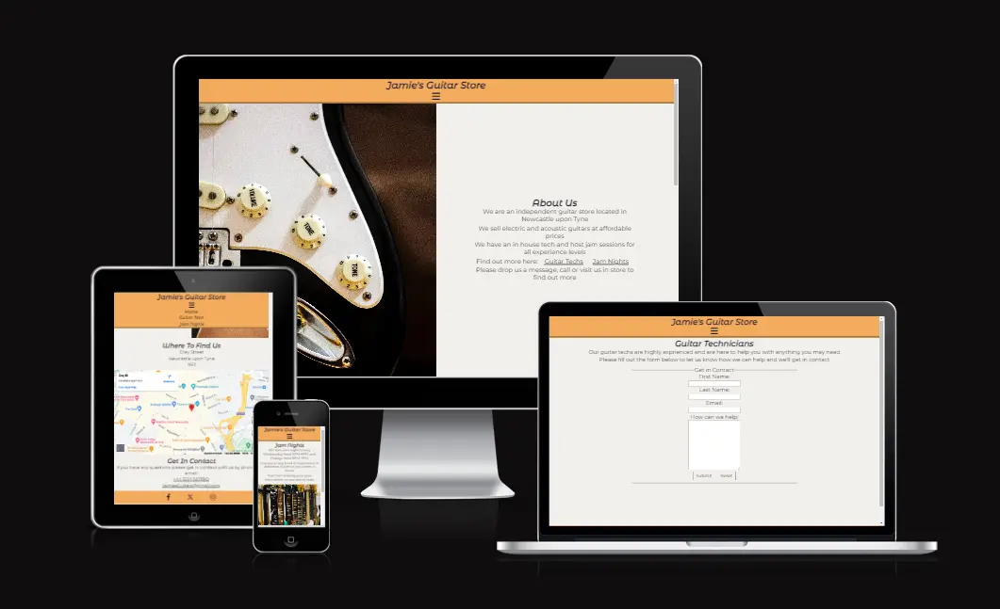
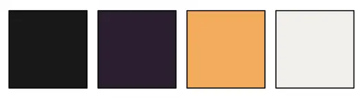
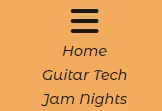
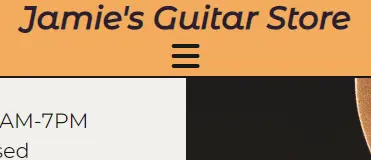
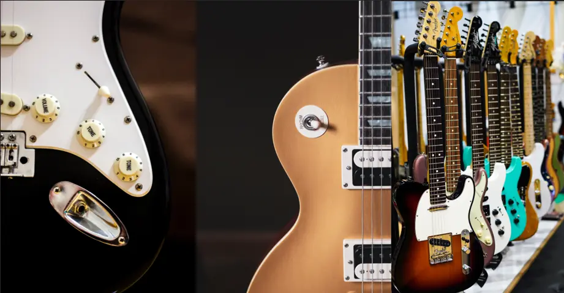
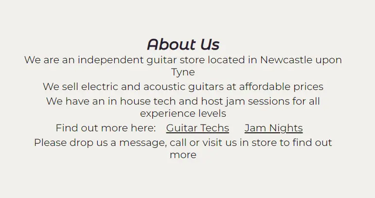
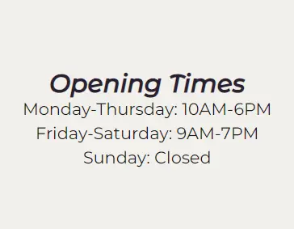
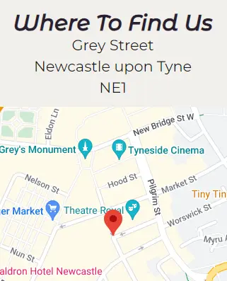
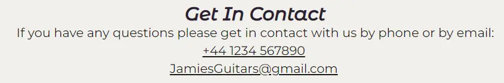
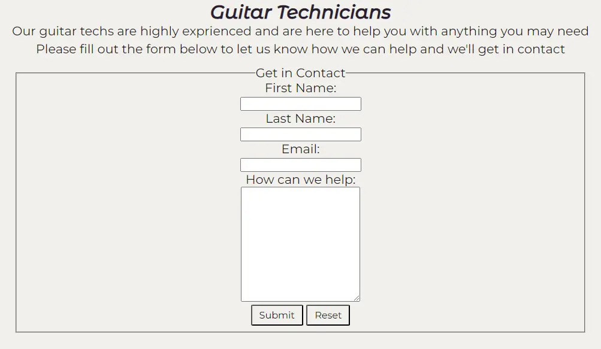

# Jamie's guitar Shop

Jamie's Guitar Shop is a small independent guitar shop in the heart of Newcastle.

The webiste is designed to show customers the services the shop provides.

<!--add contents section-->

## Planning and Development

- __Target Audience__

The target audience for the website is Guitar Players.

The website aims to infrom guitarists of the services and products provided by the shop.

These are people who:

* Are looking to purchace new guitar gear (e.g. guitars, amps, straps etc.).

* Are looking to join a community of poeple to play guitar with.

* Are looking for a guitar tech for any alterations to their guitars.

 

- __User Stories__

    * As a user, I want to find out more about Jamie's Guitar Shop.

    * As a user, I want to find a local guitar shop.

    * As a user, I wnat to find a community of guitar players.

    * As a user, I want to find a reliable guitar tech.

 

- __Site Objectives__

    * To inform customers of a local shop.

    * To show the user where to find the shop.

    * To give the user a way to contact the shop.

    * To inform users when they can visit.

    * To inform users when events are happening.

    * To help customers get in touch with a guitar tech.

 

- __Approach__

    * The site will be created witht he principles of user design.

    * The site will provide users with information about the shop.

    * The site will provide users with a way to contact the shop.

    * The site will provide users with a way to find it on social media.

    * The site will be accessible.

    * The site will be easiliy navigated and consistant throughout.

 

- __Colour Scheme__

The colours of the site were chosen to match the colours of the guitars and to contrast eachother.

* The yellow colour was picked as a common colour for acoustic guitars while matching the Les Paul image.

* The dark purple was piced for titles and social links as it contrasts the yellow and gives some varience from the text.

* The text is a very dark grey chosen to make the text slightly less harsh wile aslo maintaining contrast

* Finally the background of the whole site is an off-white making it easier to look at whilst also matching the white on the Stratocatser.

 

- __Typography__

The fonts were chosen to allow for easy reading in the document whilst the titles give a more welcoming vibe.

* Montserrat Alternatives: Gives the titles a more laid back and welcoming vibe to the site whist staying easily readable.

* Monserrat: This is a clear and concise font that is easiliy legible whilst being a slightlyu toned down version of the title font.

 

## Features

### Existing Features

- __Navigation Dropdown__

* The navigation dowpdown menu is there to help users navigate the site.

* It has links to the home page, guitar jamns page and guitar techs page.

 

- __Sticky Navigation bar__

* The sticky navigation bar allows users to navigate the site no matter where on the page they are.

* It sticks in a fixed posiytion on the top of each page.

* It uses a burger icon to helkp the user reconise it's use.

 

- __Images__

* The images chosen were two of the most popular guitars on the home page and a selection on the jams page.

* The home page guitars were chosen as they will be easily reconisable.

* The selection was chosen to show more variation in guitars.

The links to eacfh image is:

* Stratocaster (1st home page image): https://www.pexels.com/photo/electric-guitar-amplifier-cord-port-808354/

* Les Paul (2nd home page image): https://www.pexels.com/photo/close-up-shot-of-a-guitar-8134200/

* Asorted guitars (guitar jams image): https://www.pexels.com/photo/electric-guitars-on-display-5396357/

 

- __About Us Section__

The about us section gives some basic information about the shop and can direct users to other pages.

* It lays out what the store is, what they sell and what services they can provide.

* there are also links within the text so users can get to other pages of the website.

 

- __Opening Times__

The opening times section allows useres to know when they can visit and call the shop.

 

- __Where To Find Us__

This section has 2 key features:

*Address*

This allows users to find the shop via map apps.

*Map*

This is taken from google maps.

* The map is embeded from google maps and so is fully interactable.

* The map allows users of the website to get a general location of the shop making it easier to find.

 

- __Get In Contact__

This section allows users to contact the shop.

They can contact the shop by:P

* Email

* Phone

Both of these are linked alowing users click the method of contact and they will be directed to their Email or Skype/phone dial.

 

- __Social Links__

The footer contains all the social media links for users to follow and find out more about the shop.

It contains links to:

* Facebook

* X/Twitter

* Instagram

They are represeneted by icons taken from https://fontawesome.com.

Each link opens in a new tab as they are going to external websites.

 

- __Guitar Technicians__

This page gives users some information about the guitar store technicions and allows them to submit a form to contact one.

Some features of the form are:

* Each field being required before submition.

* A section for the user to tell the shop what they need help with.

* Submit and Reset buttons that change colour when hovered over.

* Users are sent to another page once the form is submited.

 

- __Thank You Page__

The Thank You Page displays when a user has submitted a form.

It displays a small message thanking the user for sending a message and confirming their request has been sent.

 

- __Jam Nights__

The Jam Night Page gives the user information on social nights at the shop.

The page was desinged to be:

* Welcoming to all players.

* Informative to when they are.

* Show inclucivity to anyone without an instrument.

 